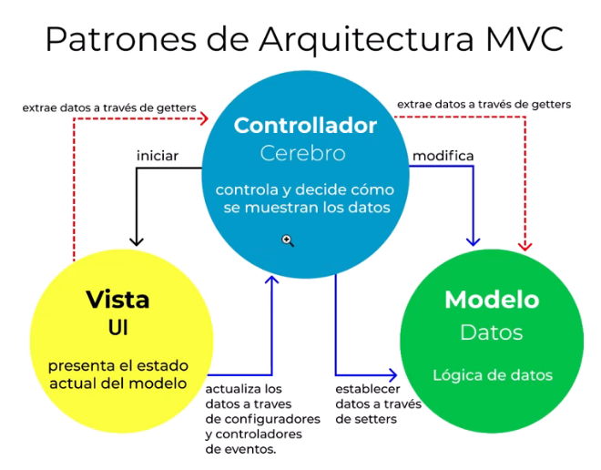

# Symfony 4

* 1 - Introducción e Instalación del Framework
    * https://www.youtube.com/watch?v=d1EoJFrJKZM&list=PLDbrnXa6SAzXBvGdqrSftpUJlOoThypJB&index=1

* 2 - Curso Symfony 4 - Arquitectura del Framework y directorios
    * https://www.youtube.com/watch?v=Z417pX1QPDE&list=PLDbrnXa6SAzXBvGdqrSftpUJlOoThypJB&index=2

* 3- Mi primer controlador
    * https://www.youtube.com/watch?v=N3EjgRvLKbU&list=PLDbrnXa6SAzXBvGdqrSftpUJlOoThypJB&index=3

* 4 - Enrutamiento de symfony
    * https://www.youtube.com/watch?v=moA16IdUv0I&list=PLDbrnXa6SAzXBvGdqrSftpUJlOoThypJB&index=4

* 5 - Función path de twig
    * https://www.youtube.com/watch?v=y2T37-cnHks&list=PLDbrnXa6SAzXBvGdqrSftpUJlOoThypJB&index=5

* 6 - Plantillas Parte 1
    * https://www.youtube.com/watch?v=5eNw92JrvCg&list=PLDbrnXa6SAzXBvGdqrSftpUJlOoThypJB&index=6

* 7 - Plantillas Parte 2 (Condicionales)
    * https://www.youtube.com/watch?v=t4f_r4S-0Ww&list=PLDbrnXa6SAzXBvGdqrSftpUJlOoThypJB&index=7

* 8 - Plantillas Parte 3 (Strings, filtros y bucles)
    * https://www.youtube.com/watch?v=fCMegiRV9DQ&list=PLDbrnXa6SAzXBvGdqrSftpUJlOoThypJB&index=8

* 9 - Plantillas Parte 4 (Assets, blocks y extends)
    * https://www.youtube.com/watch?v=prYJovf4Izs&list=PLDbrnXa6SAzXBvGdqrSftpUJlOoThypJB&index=9

* 10 - Bases de datos (PARTE 1, conexion de symfony con db)
    * https://www.youtube.com/watch?v=P4LuxmMzHmw&list=PLDbrnXa6SAzXBvGdqrSftpUJlOoThypJB&index=10

* 11 - Bases de datos (PARTE 2, crear entidad y migracion)
    * https://www.youtube.com/watch?v=wCwNla3Czv4&list=PLDbrnXa6SAzXBvGdqrSftpUJlOoThypJB&index=11

* 12 - Bases de datos (PARTE 3, guardando datos en entidad)
    * https://www.youtube.com/watch?v=c5zGOyBH9pg&list=PLDbrnXa6SAzXBvGdqrSftpUJlOoThypJB&index=12

* 13 - Bases de datos (PARTE 4, usando constructor en entidad para guardar)
    * https://www.youtube.com/watch?v=1VqV-jDl7q0&list=PLDbrnXa6SAzXBvGdqrSftpUJlOoThypJB&index=13

* 14 - Bases de datos (PARTE 5, relacion uno a muchos con symfony)
    * https://www.youtube.com/watch?v=mTU-e8B6zxI&list=PLDbrnXa6SAzXBvGdqrSftpUJlOoThypJB&index=14

* 15 - Bases de datos (PARTE 6, busquedas)
    * https://www.youtube.com/watch?v=LidzuvbFGCQ&list=PLDbrnXa6SAzXBvGdqrSftpUJlOoThypJB&index=15

* 16 - Bases de datos (PARTE 7, manipulando datos de busquedas)
    * https://www.youtube.com/watch?v=8kLvsyLcHJI&list=PLDbrnXa6SAzXBvGdqrSftpUJlOoThypJB&index=16

* 17 - Bases de datos (PARTE 8, Repositorios)
    * https://www.youtube.com/watch?v=sf3F826-gG4&list=PLDbrnXa6SAzXBvGdqrSftpUJlOoThypJB&index=17

* 18 - Formularios (PARTE 1, Renderizar formularios)
    * https://www.youtube.com/watch?v=b-sSOs1VdeM&list=PLDbrnXa6SAzXBvGdqrSftpUJlOoThypJB&index=18

* 19 - Formularios (PARTE 2, Persistir datos)
    * https://www.youtube.com/watch?v=8UwcD4SXIQo&list=PLDbrnXa6SAzXBvGdqrSftpUJlOoThypJB&index=19

* 20 - Formularios (PARTE 3, FormType y createformbuilder)
    * https://www.youtube.com/watch?v=syrAMICe_uQ&list=PLDbrnXa6SAzXBvGdqrSftpUJlOoThypJB&index=20

* 21 - FOSUSERBUNDLE (PARTE 1, Instalcion)
    * https://www.youtube.com/watch?v=gJJEeGEbu64&list=PLDbrnXa6SAzXBvGdqrSftpUJlOoThypJB&index=21

* 22 - FOSUSERBUNDLE (PARTE 2, Como funciona)
    * https://www.youtube.com/watch?v=Dv5XGFMx1XM&list=PLDbrnXa6SAzXBvGdqrSftpUJlOoThypJB&index=22

* 23 - Reto Fin del curso
    * https://www.youtube.com/watch?v=G1W0O7Gd7_A&list=PLDbrnXa6SAzXBvGdqrSftpUJlOoThypJB&index=23

## Modelo MVC



## Comandos

* Crear proyecto:

```
composer create-project symfony/website-skeleton:"^4.4" my_project_directory
```

## ORM Doctrine

* Instalar doctrine (website-skeleton ya lo instala)
    * https://symfony.com/doc/current/doctrine.html

* Configurar credencial en el .env.

* Crear db:

```
php bin/console doctrine:database:create
```

* Crear o actualiza la Entidad:
    * Nos va pedir nombre y propiedades.

```
php bin/console make:entity
```

* Despues de tener las entidad, realizar los cambios en la db:

```
php bin/console doctrine:schema:update --force
```

* Que se puede crear:

```
make:command
make:controller 
make:entity
make:form
make:functional-test
make:subscriber
make:twig-extension
make:unit-test
make:validator
make:voter
```

* Para crear un controlador:
    * Nos va pedir el nombre del mismo.

```
php bin/console make:controller
```

## ManyToOne

* Una categoria tiene muchos productos. (se puede hacer por CLI o manual)